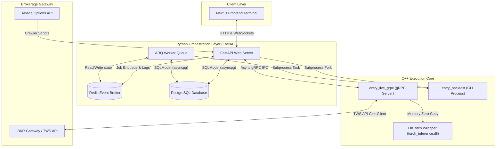
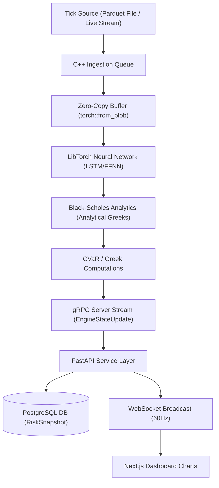
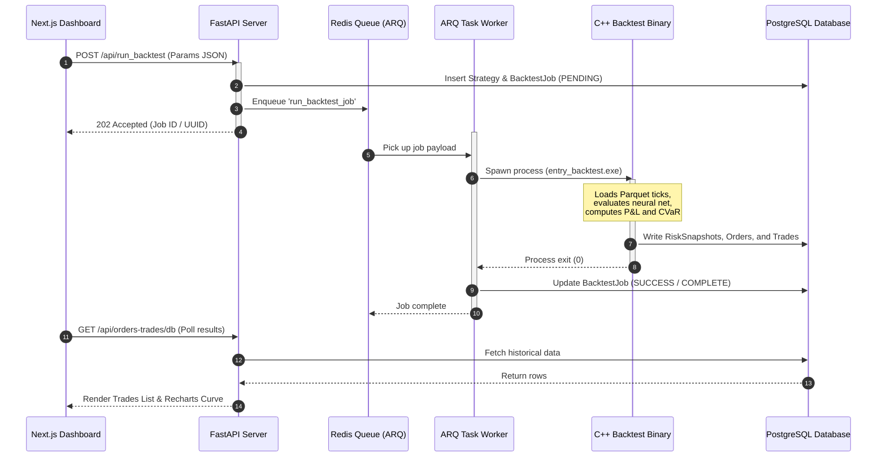

# Athena Aegis Engine

**Athena Aegis Engine** is an institutional-grade, multi-model deep hedging and options execution platform. It integrates a low-latency C++ execution engine with a Python/FastAPI backend orchestrator, a PyTorch research lab, and a responsive Next.js frontend terminal.

---

## 🏛️ The Name: Athena Aegis Engine

> *"Wisdom to predict. Protection to endure. Speed to execute."*

The name **Athena Aegis Engine** is not cosmetic — every word is a precise metaphor for a core technical pillar of this platform:

### ⚡ Athena — Intelligence & Strategic Foresight
In Greek mythology, **Athena** (Minerva in Roman) is the goddess of wisdom, mathematics, and *strategic* warfare — not raw force, but calculated, intelligent action. She is the deity most associated with foresight, invention, and rational decision-making.

In this platform, **Athena** represents the **deep learning layer**: the PyTorch neural networks (LSTM, FFNN, and Minimax Adversarial models) trained against Conditional Value-at-Risk (CVaR) loss functions. Like Athena herself, these models do not react blindly — they are trained on years of historical tick data to *anticipate* options delta movements before they happen, serving as intelligent hedging agents that compete against and surpass the classical Black-Scholes analytical delta.

### 🛡️ Aegis — Protection & Risk Management
The **Aegis** is the legendary shield of Athena — the ultimate symbol of divine protection. It was said to make its bearer invincible against any threat.

In this platform, **Aegis** represents the **options hedging and risk management layer**: the CVaR-constrained delta hedging engine, the Greek computation pipeline (delta, gamma, theta, vega), and the real-time risk snapshot monitoring. The Aegis is what stands between the portfolio and catastrophic market exposure — just as the mythological Aegis protected its bearer from any harm.

### 🚀 Engine — Low-Latency Execution
**Engine** is the machine that drives it all. This platform's execution core is written in **C++20**, using lock-free ring buffers, SPSC queues, CPU thread-affinity pinning, object-pool memory management, and zero-copy LibTorch tensor inference — all optimized to process option ticks in under 300 microseconds on the hot path.

### The Full Picture
| Word | Mythological Meaning | Technical Meaning |
|---|---|---|
| **Athena** | Goddess of wisdom, foresight, strategy | Deep learning models (LSTM, FFNN, Minimax) predicting optimal hedge ratios |
| **Aegis** | Divine protective shield, bearer of invincibility | CVaR risk engine, delta-hedge constraints, Greek surface monitoring |
| **Engine** | — | C++20 low-latency execution core, sub-300µs tick processing |

---

## 📊 System Architecture & Diagrams

### 1. High-Level Design (HLD)
Shows the architecture boundaries and major components:



### 2. Operational System Flow
Describes how ticks flow from the data layer through inference to the database and UI:



### 3. Backtest Execution Sequence
Visualizes the timeline for running an asynchronous backtest replay job:



---

## 🗂️ Project Repository Structure

```
Athena-Aegis-Engine/
├── Otrader/                 # Legacy folder (Cleaned up, moved to cpp_engine)
├── cpp_engine/              # C++ Execution Core (Ingestion, gRPC, LibTorch Inference)
├── backend_orchestrator/    # Python FastAPI web server, Redis/ARQ task queue, and tests
├── frontend_terminal/       # Next.js browser-based control dashboard UI
├── scripts/                 # Options downloading crawlers & config utility scripts
└── research/                # PyTorch ML Research Lab (differentiable CVaR, minimax)
```

---

## 🔌 API Endpoints & Interfaces

The FastAPI backend exposes the following REST, WebSocket, and internal gRPC endpoints:

### REST API (Port 8085)

#### Live Engine - Gateway & Market Data
* `POST /api/gateway/connect`: Establish gateway connection to IBKR.
* `POST /api/gateway/disconnect`: Gracefully disconnect from IBKR.
* `GET /api/gateway/status`: Check connection health state.
* `GET /api/market/status`: Check status of active market tick streams.
* `POST /api/market/start`: Activate market data ingestion.
* `POST /api/market/stop`: Halt active market data feed.

#### Strategy Management
* `GET /api/strategies`: List loaded strategies and statuses.
* `POST /api/strategies`: Instantiate a new strategy.
* `POST /api/strategies/{name}/init`: Initialize strategy state.
* `POST /api/strategies/{name}/start`: Start executing strategy rules.
* `POST /api/strategies/{name}/stop`: Stop strategy rules execution.
* `DELETE /api/strategies/{name}/remove`: Soft delete strategy from active cache.
* `DELETE /api/strategies/{name}/delete`: Hard delete strategy.

#### Backtesting & Data Scanning
* `GET /api/files`: List local Parquet / DBN files.
* `GET /api/backtest/strategies`: Query compiled C++ strategy classes.
* `GET /api/file_info?path=...`: Extract metadata parameters from a Parquet file.
* `GET /api/backtest_duration`: Retrieve date ranges covered by symbol datasets.
* `POST /api/run_backtest`: Enqueue a backtest job on ARQ (HTTP 202).
* `POST /api/backtest/cancel`: Cancel the active backtest process.
* `GET /api/backtest/jobs/{id}/report`: Download PDF strategy report.

#### Database Historical Views
* `GET /api/orders-trades/db`: Query historical orders & trades.
* `GET /api/database/contracts`: Fetch summary metrics of option chain contracts.

### WebSockets
* `WS /ws/logs`: 60Hz real-time trace log streaming buffer.
* `WS /ws/strategies`: Multi-client updates channel.

---

## 💾 Database Schema Mapping (SQLModel)

Persistent schemas are managed using SQLModel (SQLAlchemy + Pydantic) mapping to PostgreSQL:

* **`Strategy`**: Registered strategy settings and parameters (JSONB).
* **`BacktestJob`**: Status (`PENDING`, `COMPLETE`, `FAILED`), correlation UUIDs, and summary metrics.
* **`ModelRegistry`**: Registered PyTorch model paths (`.pt`), inputs, and CVaR performance weights.
* **`TickArchive`**: Tick index, spot, and IV metadata.
* **`RiskSnapshot`**: Real-time delta, gamma, theta, vega, CVaR, and P&L indicators per tick.
* **`OrderRecord` / `TradeRecord`**: Logs execution price, direction, volume, and execution timestamps.

---

## 🚀 Getting Started & How to Use

To run the Athena Aegis Engine platform locally, follow the steps below:

### Prerequisites
* **Docker Desktop**: Required to spin up PostgreSQL and Redis.
* **CMake & Ninja / MSVC compiler**: Required for compiling the C++ execution core.
* **Node.js (v18+)**: Required for running the Next.js frontend terminal.
* **Python (3.12+)**: Required for running the backend orchestrator and ML research scripts.

### 1. Build C++ Engine
Navigate to the `cpp_engine` directory, create a build folder, and compile targets:
```powershell
cd cpp_engine
mkdir build
cd build
cmake -G Ninja ..
ninja
```

### 2. Launch Services
You can orchestrate and run all microservices concurrently using the root PowerShell script:
```powershell
.\start.ps1
```
This script will automatically:
1. Spin up PostgreSQL (:5433) and Redis (:6379) via docker-compose.
2. Launch C++ helper processes (`entry_gateway`, `entry_market_data`, `entry_live_grpc`).
3. Start the FastAPI backend servers on `http://localhost:8085`.
4. Launch the ARQ queue workers for task queue ingestion.
5. Open the Next.js Frontend Dashboard on `http://localhost:3000`.

To stop all running microservices and teardown containers:
```powershell
.\stop.ps1
```

---

## 🔗 Reference APIs & Git Repositories

Athena Aegis Engine integrates the following external libraries, APIs, and frameworks:

### Git Repositories & SDKs
* **LibTorch (PyTorch C++ API)**: [pytorch/pytorch](https://github.com/pytorch/pytorch) - Used inside `cpp_engine/runtime` for low-latency neural model evaluation.
* **ZeroMQ (cppzmq)**: [zeromq/cppzmq](https://github.com/zeromq/cppzmq) - Lightweight messaging library for core tick pipeline transfer.
* **nlohmann/json**: [nlohmann/json](https://github.com/nlohmann/json) - JSON serializer for strategy settings mapping.
* **Interactive Brokers C++ API**: [Interactive Brokers TWS API](https://github.com/InteractiveBrokers/twsapi_mac_unix_generic) - Integrated inside the gateway core for live trade orders and tick data streaming.
* **SQLModel**: [tiangolo/sqlmodel](https://github.com/tiangolo/sqlmodel) - SQLModel ORM integration mapping to PostgreSQL.
* **OTrader (Legacy Precursor)**: The original legacy repository codebase from which Athena Aegis Engine was refactored, modernized, and restructured to support scalable microservices and clean low-latency separations.

### Financial REST / WebSocket APIs
* **Alpaca Option Chains & Bars**: [Alpaca Market Data API](https://docs.alpaca.markets/docs/about-options) - Utilized by python crawlers inside `scripts/` to seed contracts database and download raw backtest Parquet bars.
* **IBKR Gateway Interface**: [IBKR TWS API Gateway](https://interactivebrokers.github.io/) - Client broker interface wrapper for executing hedge orders.
