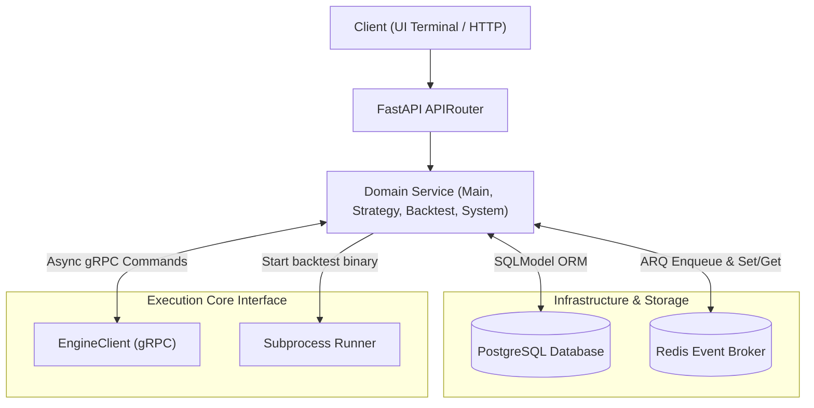
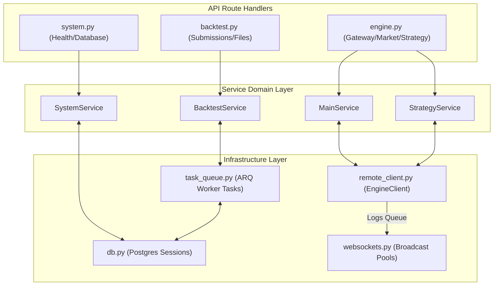
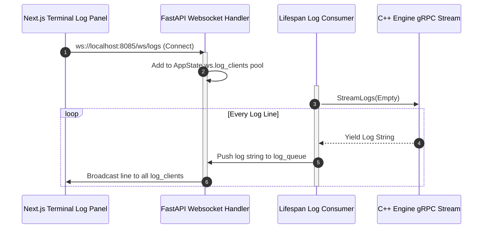

# Backend Orchestration Server (backend_orchestrator)

The **Backend Orchestration Server** is a Python FastAPI web server that handles front-facing REST endpoints, WebSocket broadcasts, database persistence (SQLModel over PostgreSQL), and asynchronous backtesting task queues (Redis and ARQ workers). It acts as the orchestration layer between the Next.js control panel and the compiled C++ execution core.

---

## 📊 Architecture & Integration Diagrams

### 1. Inbound Request Routing Flowchart
Visualizes how HTTP requests, WebSocket handshakes, and database updates are handled:



### 2. High-Level Design (HLD)
Shows the backend modules and service layers:



### 3. Log Streaming Sequence Diagram
Traces the real-time log ingestion and broadcast flow:



---

## 🗂️ Directory Layout

```
backend_orchestrator/
├── src/
│   ├── api/                 # HTTP routers & schemas (engine.py, backtest.py, system.py)
│   ├── services/            # Domain service logic classes (main.py, strategy.py, backtest.py)
│   ├── infra/               # Infrastructure (remote_client.py, db.py, task_queue.py, websockets.py)
│   ├── proto/               # Generated gRPC code (otrader_engine_pb2_grpc)
│   └── utils/               # Helpers (parquet tools, PDF charts generators)
├── tests/                   # Pytest API tests (test_gateway.py, test_strategies.py, etc.)
├── requirements.txt         # Package dependencies (fastapi, sqlmodel, arq)
├── pytest.ini               # Pytest configurations
└── server_fastapi.py        # Web app entry point & lifespan manager
```

---

## 💾 REST & Database Integrations

* **REST APIs**: Interfaces with the Next.js frontend using JSON payloads (defined in `api/schemas/`). Calls are validated by Pydantic models.
* **WebSocket Channels**:
  * `/ws/logs`: Pushes engine trace logs to the frontend at up to 60Hz.
  * `/ws/strategies`: Handles client strategy state subscription.
* **Database Access**: Uses SQLModel over `asyncpg` for PostgreSQL connection pooling. Mocks are injected in unit tests using `pytest-mock` by monkeypatching the `async_session_maker` function.
