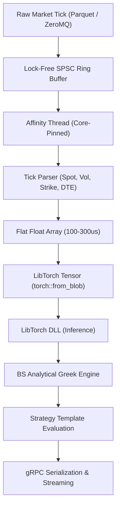
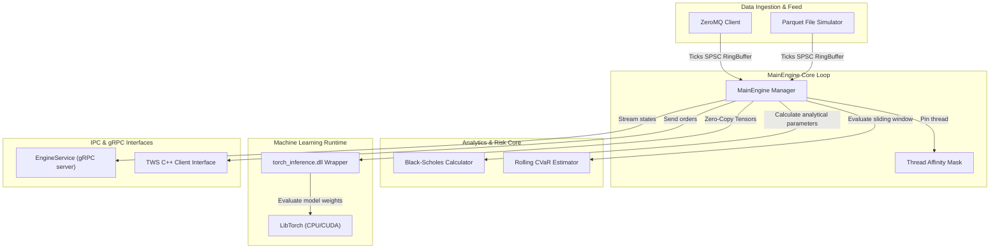
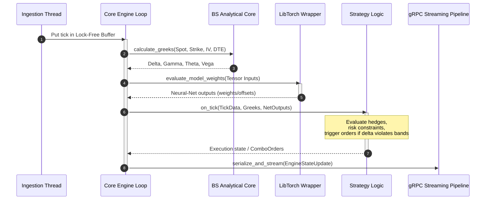

# C++ Execution Engine (cpp_engine)

The **C++ Execution Engine** is the core latency-sensitive component of the Affinity-Core platform. It handles tick ingestion, options analytics (Black-Scholes Greeks), neural network inference via LibTorch, and market connectivity (IBKR API via TWS C++ API).

---

## 📊 Component-Level Diagrams

### 1. Ingestion & Inference Flowchart
Describes the lifecycle of a market data tick through parsing and neural-net evaluation:



### 2. High-Level Design (HLD)
Shows the C++ modules and their execution boundaries:



### 3. Tick Execution Sequence
Visualizes execution path in the hot tick loop:



---

## 🗂️ Folder Structure

```
cpp_engine/
├── core/                    # Engine implementation (OptionStrategyEngine, Black-Scholes)
├── infra/                   # Networking & client implementations (IB C++ SDK wrapper)
├── proto/                   # Protobuf definitions and gRPC service descriptors
├── runtime/                 # Machine learning DLL wrappers (LibTorch bindings)
├── strategy/                # Base option strategy templates & compiled implementations
├── utilities/               # Helper routines (Affinity pinning, lock-free buffers, logs)
├── thirdparty/              # Vendor dependencies (nlohmann_json, zmq)
├── build/                   # Compilation files (Ninja/CMake)
└── strategy_config.json     # Default trading configuration settings JSON
```

---

## 💾 Data & REST/gRPC Interfaces

* **Data Formats**: Market ticks are ingested as binary packets or mapped from Parquet files containing `ts_recv`, `spot`, `bid`, `ask`, `vol`, `underlying_spot`, `strike`, and `dte` fields.
* **LibTorch Integration**: Tensor inputs are passed to model weights using `torch::from_blob` referencing memory allocations directly to guarantee zero-copy operations.
* **gRPC Pipeline**: Bidirectional streaming runs on `grpcio` inside port `50051`:
  * `StartBacktest`: Stream server updates (`EngineStateUpdate`).
  * `SendCommand`: Client sends remote instruction updates (`ConnectGateway`, `AddStrategy`, etc.).
