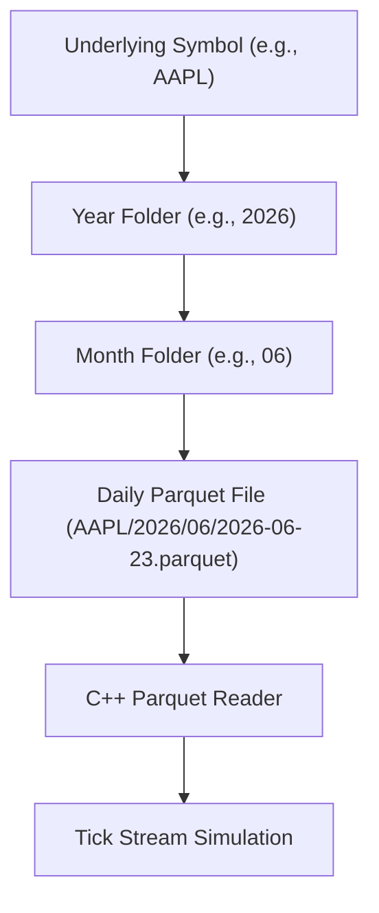
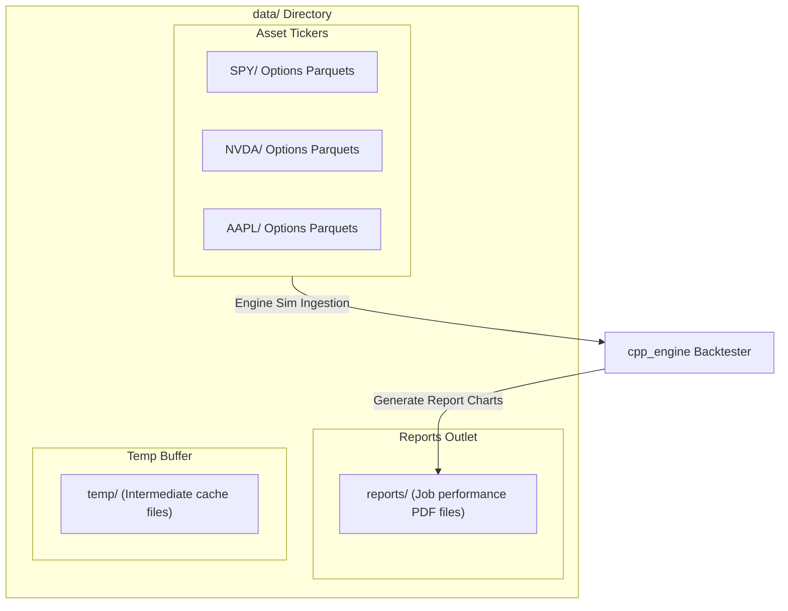
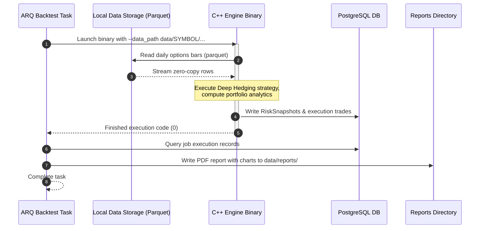

# Market Data Storage & Reports (data)

This directory is the local data repository for options tick and bar datasets (saved in zero-copy Apache Parquet format) and generated PDF performance reports.

---

## 📊 Data Ingestion & Layout Diagrams

### 1. File Path Resolution Flowchart
Describes how the backend orchestrator and C++ engine resolve local file locations for backtesting:



### 2. High-Level Design (HLD)
Shows the logical grouping of datasets and output reports:



### 3. Backtest Data Stream Sequence
Visualizes the read/write sequences of data files during a backtesting job execution:



---

## 🗂️ Folder Structure

```
data/
├── [SYMBOL]/                # Options data directories grouped by ticker symbol
│   └── [YYYY]/              # Directory organized by Year (e.g., 2026)
│       └── [MM]/            # Directory organized by Month (e.g., 06)
│           └── *.parquet    # Daily options bar data parquet files
├── reports/                 # Output folder for generated backtest PDF reports
└── temp/                    # Temporary working cache directory
```

---

## 💾 Parquet Columns & Data Format

The daily options bar files stored in the symbol directories must conform to the following schema:

| Column Name | Type | Description |
| :--- | :--- | :--- |
| `ts_recv` | Timestamp | Timestamp when the bar was completed (UTC / local) |
| `symbol` | String | OCC Option Contract code (e.g., `AAPL260619C00150000`) |
| `bid_px` | Double | Inside bid price |
| `ask_px` | Double | Inside ask price |
| `underlying_bid_px` | Double | Bid price of the underlying asset |
| `underlying_ask_px` | Double | Ask price of the underlying asset |
| `strike` | Double | Contract strike price |
| `dte` | Double | Days to expiration scaled in years ($DTE / 365.25$) |
| `vol` | Double | Implied volatility |
