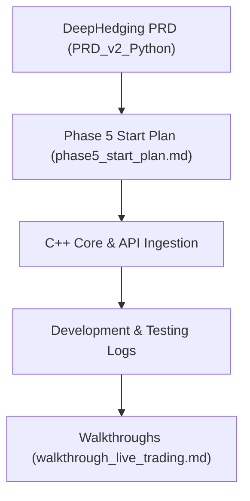
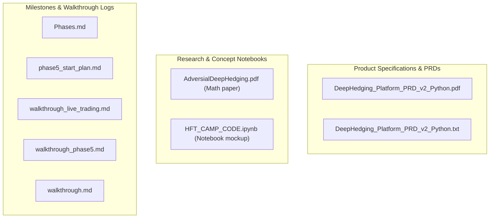
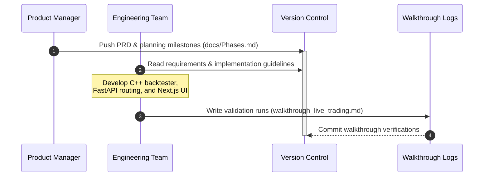

# Platform Documentation & Specifications (docs)

This directory hosts product requirements documents (PRD), developmental phase planning, mathematical research references, and engineering walkthrough logs.

---

## 📊 Document Lifecycle Diagrams

### 1. Project Phase Rollout Flowchart
Describes the sequential implementation phases tracked inside this folder:



### 2. High-Level Design (HLD)
Groups documentation files by domain context:



### 3. Development Ingestion Sequence
Visualizes the pipeline for updating platform specs from PRD design to validation walkthroughs:



---

## 🗂️ Documentation Folder Structure

```
docs/
├── AdversialDeepHedging.pdf             # Academic paper detailing minimax robust hedging logic
├── DeepHedging_Platform_PRD_v2_Python.pdf # Platform Product Requirements Document (PDF)
├── DeepHedging_Platform_PRD_v2_Python.txt # Plain text version of the PRD
├── HFT_CAMP_CODE.ipynb                  # Prototyping notebook for high frequency deep hedging
├── Phases.md                            # Detailed development roadmap milestones list
├── new_chat_brief.md                    # Platform context outline for LLM context resumption
├── phase5_start_plan.md                 # Detailed deployment schedule for Phase 5
├── steps.md                             # Step-by-step checklist of build commands
├── walkthrough.md                       # High-level walkthrough of components
├── walkthrough_live_trading.md          # Verification steps for live options trading gateway
└── walkthrough_phase5.md                # Phase 5 checklist execution summary log
```
