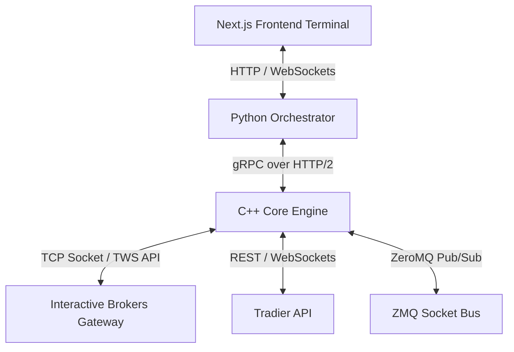

# System Internals and Networking Architecture

This document provides a technical overview of the operating system internals, concurrency models, and networking technologies implemented across the components of the Athena Aegis Engine (Affinity-Core).

---

## 1. Operating System Internals & Concurrency (C++ Engine)

The C++ core engine (`cpp_engine`) implements low-latency patterns to guarantee predictable response times under heavy market data load.

### Lock-Free Programming
*   **Bounded Ring Buffers**: Decoupled messaging is implemented using lock-free ring buffers (Multi-Producer, Single-Consumer for the main event queue, and Single-Producer, Single-Consumer for strategy callbacks). This avoids kernel mutex context switches.
*   **Preventing False Sharing**: Shared index variables for queue producers and consumers are aligned/padded to typical CPU cache line boundaries (`alignas(64)` or similar) to prevent false sharing and cache line invalidation ping-pong across cores.

### Multi-Threading and Scheduling
*   **Pipelined Layout**: Specific worker threads partition execution:
    *   **Main Worker Thread**: Handles market snapshots, portfolio metrics, risk evaluations, and gateways.
    *   **Strategy Execution Thread**: Dedicated solely to running user strategy calculations, protecting the core thread from delay.
    *   **Timer Thread**: Dispatches periodic heartbeat and scheduled strategy events.
*   **Efficient Synchronization**: When queues are empty, worker threads suspend execution using condition variables (`std::condition_variable`) rather than busy-waiting, reducing CPU resource contention.

### Custom Memory Allocation
*   **Pre-allocated Object Pools**: High-frequency allocations (snapshots, events, logs, order/trade trackers) acquire and release memory blocks from custom-managed object pools. This bypasses runtime heap allocation (`malloc`/`free`) to eliminate tail-latency spikes.
*   **Move Semantics & Non-owning Views**: Utilizes modern C++ features like move constructors/assignment operators (`std::move`) and contiguous spans (`std::string_view`, etc.) to pass references without executing data-copy paths.

---

## 2. Networking Architecture

The architecture relies on a multi-tier networking structure to connect the trading UI, orchestrator, and high-frequency execution engine.

### gRPC (High-Performance RPC)
*   Used for inter-process communication (IPC) between the Python orchestrator service (`backend_orchestrator`) and the C++ engine (`cpp_engine`).
*   Configured via Protocol Buffer definitions (`otrader_engine.proto`), allowing fast serialization and strongly typed communication streams over HTTP/2.

### ZeroMQ (ZMQ)
*   Utilized as a high-frequency socket communication layer (`libzmq3-dev`) supporting PUB/SUB and REQ/REP architectures for internal message broadcasting and streaming market updates.

### WebSockets
*   **Real-Time Data Streaming**: Implemented in the Python orchestrator (via FastAPI/websockets) to push sub-second telemetry, telemetry charts, active positions, and logs directly to the Next.js UI client.
*   **External Feeds**: Used by the C++ engine to ingest raw real-time quotes/trades from brokerages (like Tradier).

### REST & Gateway Socket Communication
*   **Tradier API**: Handled via standard HTTP REST connections (using `libcurl` in C++) for account authorization and pulling historical/on-demand chain data.
*   **Interactive Brokers (IB) Gateway**: Utilizes the TWS socket client API to set up a direct TCP/IP connection to an active Trader Workstation (TWS) or IB Gateway instance to submit orders and fetch execution reports.
