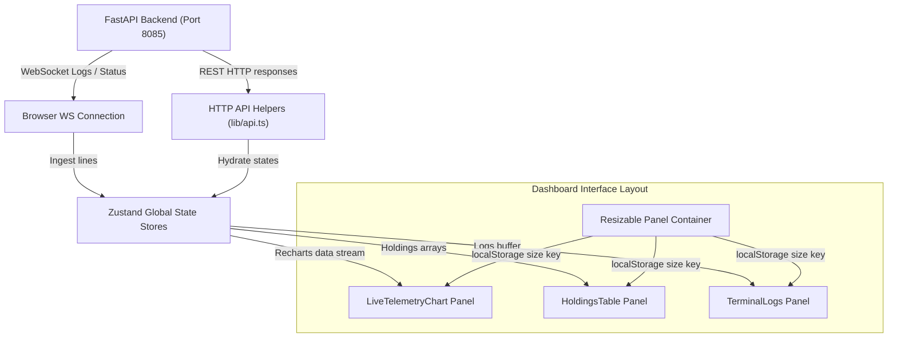
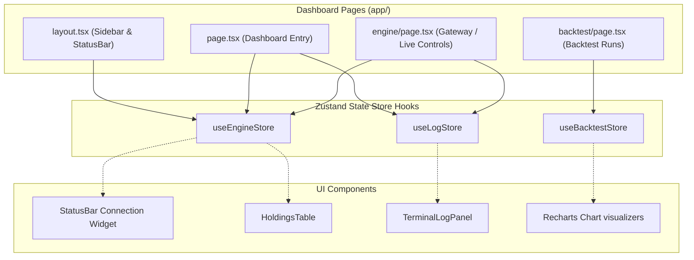
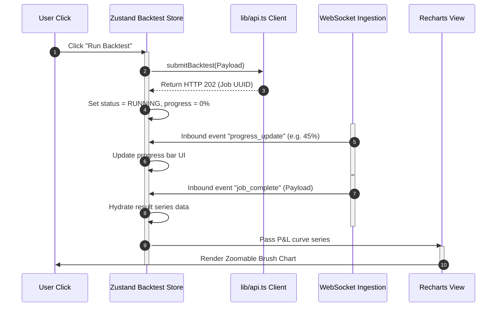

# Frontend Dashboard Terminal (frontend_terminal)

The **Frontend Dashboard Terminal** is a Next.js (App Router) web interface designed for real-time monitoring and controlling of the Athena Aegis Engine platform. It displays live trading parameters, strategy holdings, execution logs, and historical backtesting chart visualizations.

---

## 📊 Client-Side Integration Diagrams

### 1. State Ingestion & Layout Flowchart
Visualizes how inbound updates trigger component updates:



### 2. High-Level Design (HLD)
Shows the dashboard terminal component boundaries:



### 3. Backtest UI Render Sequence
Visualizes the flow when triggering a backtest from the browser:



---

## 🗂️ Folder Structure

```
frontend_terminal/
├── app/                     # Next.js App Router Pages (engine, backtest, system layout)
├── components/              # UI widgets (holding tables, forms, logs, and split containers)
├── lib/                     # Client libraries (Axios API calls, WS client wrapper, Types)
├── styles/                  # Styling configurations (Tailwind styles, global themes)
├── public/                  # Static media assets & icons
├── package.json             # NPM package scripts & dependencies
└── tailwind.config.ts       # Tailwind CSS design system rules
```

---

## 💾 Data & REST API Client Integration

* **HTTP REST Requests**: Axios wrappers inside `lib/api.ts` connect to the backend (Port 8085) for connectivity commands (`connect`, `disconnect`), strategy configurations (`init`, `start`, `stop`), and backtest scheduling.
* **WebSocket Feeds**:
  * Real-time logs are parsed and held inside the Zustand log store, capping the buffer size locally to prevent memory leaks during long trading sessions.
  * Resizable split panes use mouse drag handlers and commit the current width/height percentages to `localStorage` under `athena_aegis_strategy_layout` to persist configuration across browser restarts.
