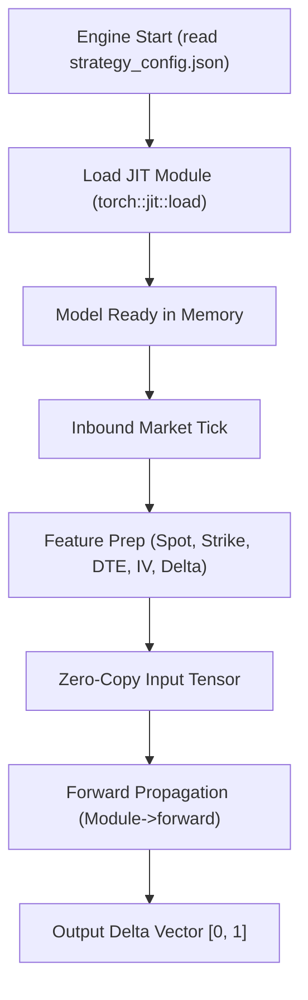
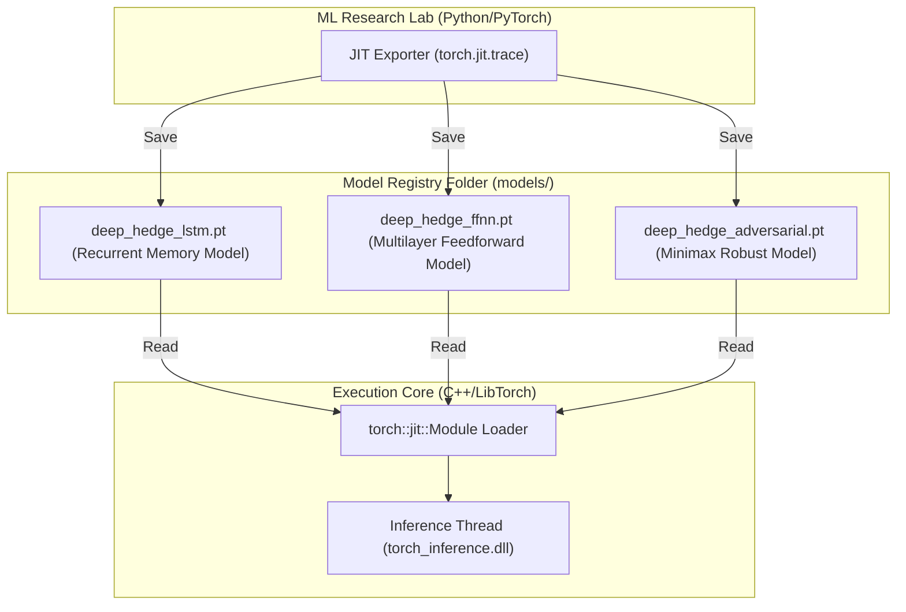
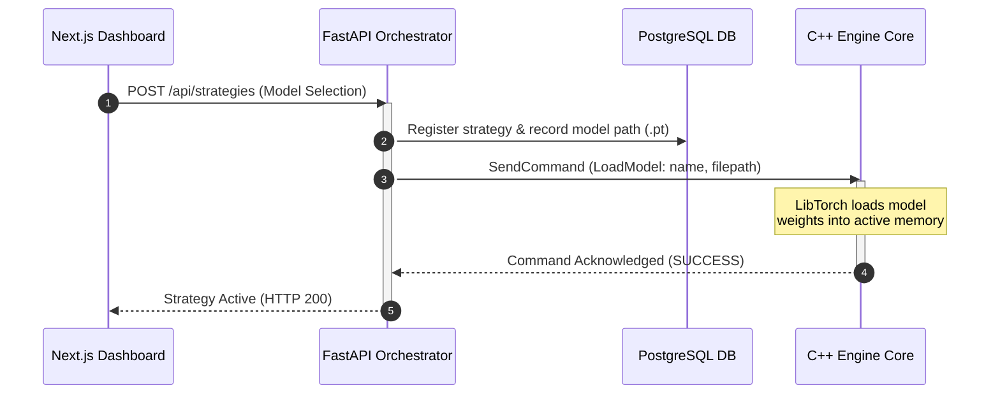

# Trained Neural Models Registry (models)

This directory serves as the persistent registry for compiled neural network weights exported in TorchScript serialization format (`.pt`). These models are loaded by the C++ engine runtime to perform optimal delta hedging predictions.

---

## 📊 Neural Model Lifecycle Diagrams

### 1. In-Engine Inference Flowchart
Describes how the C++ execution core loads the weights and evaluates a live feature tensor:



### 2. High-Level Design (HLD)
Shows the model interface boundary between Python research training and C++ engine inference:



### 3. Model Registration & Loading Sequence
Visualizes the sequence of registering a model via REST API and invoking it in the live trading engine:



---

## 🗂️ Registry Folder Structure

```
models/
├── deep_hedge_adversarial.pt # Adversarial minimax deep hedging TorchScript model
├── deep_hedge_ffnn.pt        # Feedforward neural network deep hedging TorchScript model
└── deep_hedge_lstm.pt        # LSTM recurrent network deep hedging TorchScript model
```

---

## 💾 Model Interfaces

* **TorchScript Serialization**: PyTorch neural nets are converted to portable TorchScript using tracing. This decouples the execution core from the Python interpreter, allowing the C++ runtime to evaluate predictions with microsecond latency.
* **Loading Routine**:
  ```cpp
  #include <torch/script.h>
  
  torch::jit::Module module;
  try {
      module = torch::jit::load("models/deep_hedge_lstm.pt");
  } catch (const c10::Error& e) {
      std::cerr << "Error loading deep hedging model\n";
  }
  ```
