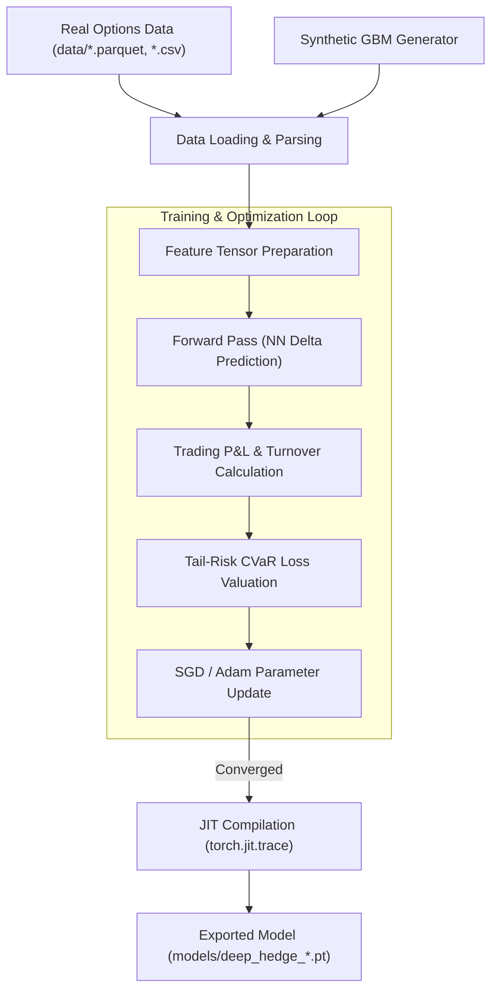
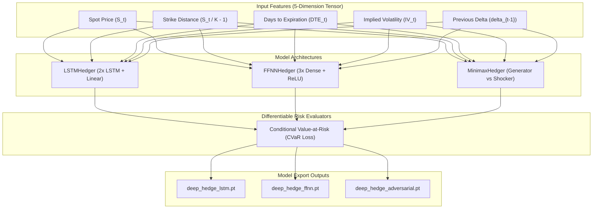
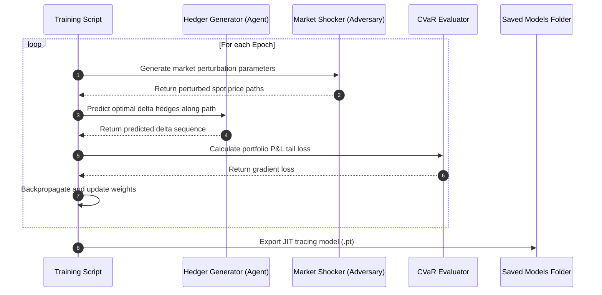

# PyTorch Machine Learning Research Lab (research)

This directory hosts the PyTorch-based machine learning research lab for training Deep Hedging models. It supports standard Feed-Forward Neural Networks (FFNN), Long Short-Term Memory (LSTM) recurrent networks, and Minimax Adversarial models optimized using differentiable risk metrics (CVaR).

---

## 📊 Research & Training Diagrams

### 1. Training & Export Flowchart
Visualizes the training process from input data or synthetic path generation to the JIT TorchScript export:



### 2. High-Level Design (HLD)
Represents the neural network architectures and feature dimensions inside the lab:



### 3. Minimax Training Sequence
Visualizes the epoch loop for training the adversarial Deep Hedging model:



---

## 🗂️ Folder Structure

```
research/
├── train_adversarial.ipynb  # Minimax adversarial model trainer
├── train_ffnn.ipynb         # Feed-forward neural network options hedger trainer
└── train_lstm.ipynb         # LSTM recurrent neural network options hedger trainer
```

---

## 💾 Model Configuration & Data Specification

* **Input Feature Map**: Model inputs are tensors of shape `(batch_size, sequence_length, 5)` consisting of:
  1. Underlying spot price.
  2. Normalized strike distance: $(S_t / K) - 1.0$.
  3. Time-to-maturity (DTE) scaled in years.
  4. Implied Volatility (approximate or raw).
  5. Delta from previous tick to control transaction costs.
* **Loss Metric**: Unlike standard mean-squared error, training minimizes the Conditional Value-at-Risk (CVaR) of the hedging portfolio:
  $$\text{CVaR}_\alpha(X) = \mathbb{E}[-X \mid X \le q_\alpha]$$
  where $X$ is the path hedging P&L including a transaction cost penalty rate.
