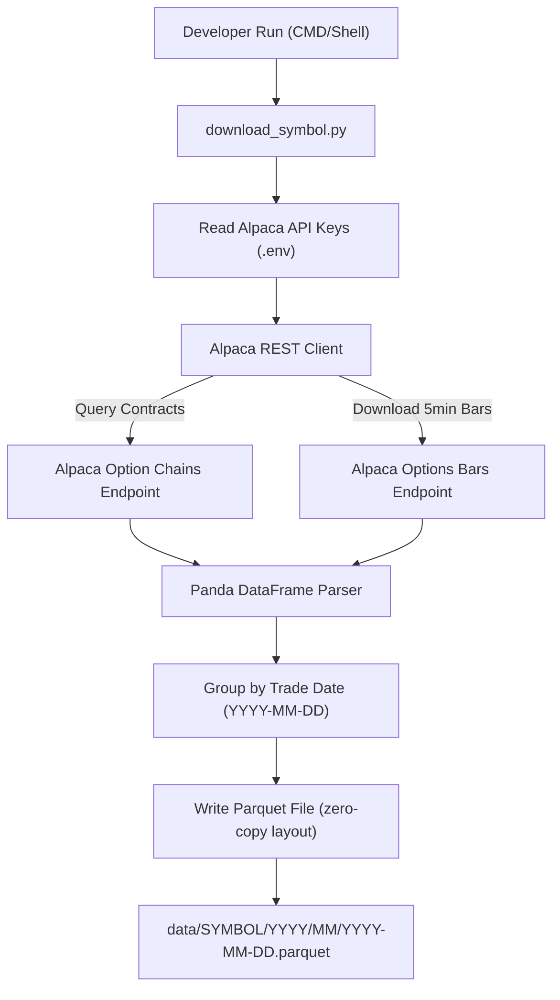
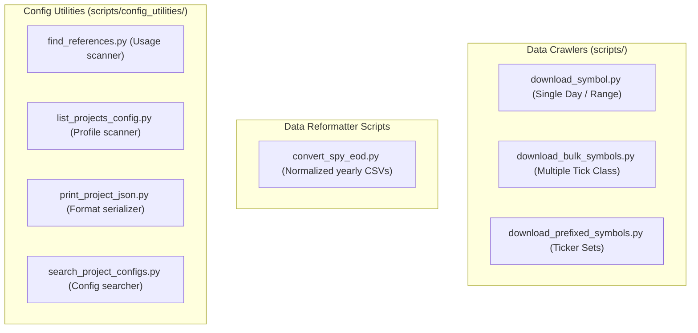
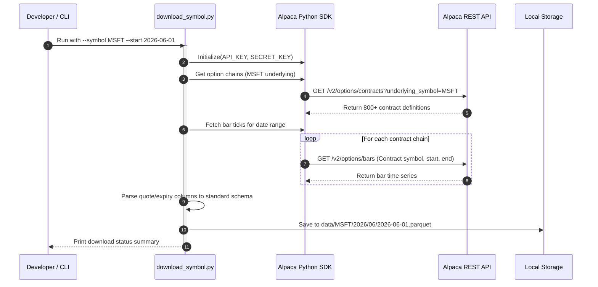

# Utility & Crawler Scripts (scripts)

This directory contains utility scripts to list, query, download, and format options and equity data for backtesting, as well as configuration indexers.

---

## 📊 Script Execution Diagrams

### 1. Market Data Crawler Flowchart
Visualizes how raw option chains are queried, downloaded, and structured for backtesting:



### 2. High-Level Design (HLD)
Shows the script utilities grouping:



### 3. Option Chain Ingestion Sequence
Details the network call flow to cache options contracts locally:



---

## 🗂️ Folder Structure

```
scripts/
├── config_utilities/        # Configuration scanning and formatting utilities
│   ├── find_references.py
│   ├── list_projects_config.py
│   ├── print_project_json.py
│   └── search_project_configs.py
├── README.md                # Documentation folder map
├── convert_spy_eod.py       # SPY EOD pricing reformatter
├── download_alpaca_options.py # Comprehensive underlying options crawler
├── download_bulk_symbols.py # Multi-contract range download utility
├── download_prefixed_symbols.py # Download ticker listings by prefix
├── download_symbol.py       # Query single underlying options bar data
├── list_all_alpaca_symbols.py # Query active options-eligible underlying assets
├── list_available_symbols.py # Scan local directories for data duration
├── list_downloadable_symbols.py # Query Alpaca API expiration dates
├── run_checksum_tests.ps1   # PowerShell checksum tests CI runner
├── verify_determinism.py    # NFR-03 Determinism validator (Subprocess)
└── verify_determinism_grpc.py # NFR-03 Determinism validator (gRPC Stream)
```

---

## 🔌 API & Integration Contracts

* **Alpaca REST Integration**: Crawler scripts utilize the `alpaca-py` library to query market option chains and bars. Authentication is injected using `APCA_API_KEY_ID` and `APCA_API_SECRET_KEY` environment variables.
* **Storage Schema**: The final downloaded files are serialized into standardized Parquet columns matching the backtesting engine’s Tick schema requirements.